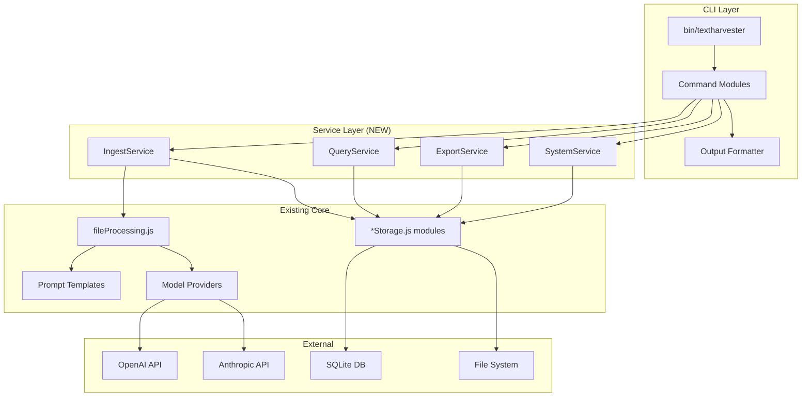

# TextHarvester CLI Design Document

## Overview

This document describes the technical design for the TextHarvester Command Line Interface (CLI). The CLI provides 100% feature parity with the web application while being optimized for AI agent orchestration as the primary use case.

### Design Philosophy

1. **AI-First Design**: JSON output is the default; human-readable formats are opt-in
2. **Service Layer Separation**: Controllers are thin wrappers; business logic lives in reusable services
3. **Predictable Behavior**: Consistent exit codes, structured errors, and idempotent operations
4. **Minimal Dependencies**: Use lightweight CLI libraries; avoid heavy frameworks
5. **Backward Compatibility**: Existing web functionality remains unchanged

### Key Architectural Decisions

| Decision | Rationale |
|----------|-----------|
| Node.js / Commander.js | Matches existing codebase; proven CLI framework |
| JSON output default | Optimized for AI agent parsing |
| Service layer extraction | Enables code reuse between web and CLI |
| Streaming for large exports | Memory-efficient for batch operations |
| Exit code conventions | Standard Unix exit codes for scripting |

---

## Architecture

### High-Level Architecture



### Component Architecture

1. **CLI Entry Point** (`bin/textharvester`): Parses arguments, routes to commands, handles global options
2. **Command Modules** (`src/cli/commands/*.js`): Implement subcommands (ingest, query, export, system)
3. **Service Layer** (`src/services/*.js`): Business logic extracted from controllers, reusable by CLI and web
4. **Output Formatter** (`src/cli/output.js`): Formats responses as JSON or human-readable based on flags
5. **Existing Core**: Unchanged modules for file processing, storage, and AI providers

---

## Components and Interfaces

### Core Interfaces

```javascript
/**
 * Standard CLI response format for all commands.
 * AI agents can rely on this consistent schema.
 */
const CLIResponse = {
  success: true,              // Boolean: operation succeeded
  partial: false,             // Boolean: some items failed (success can still be true)
  data: {},                   // Object: command-specific result data
  metadata: {
    command: 'ingest',        // String: command that was executed
    duration_ms: 1234,        // Number: execution time
    timestamp: 'ISO8601'      // String: completion timestamp
  }
};

/**
 * Standard CLI error format.
 * Emitted to stderr as JSON when errors occur.
 */
const CLIError = {
  success: false,
  error_code: 'VALIDATION_ERROR',  // String: machine-readable error code
  message: 'Human readable msg',   // String: human-readable description
  details: {},                     // Object: error-specific context
  metadata: {
    command: 'ingest',
    timestamp: 'ISO8601'
  }
};

/**
 * Configuration interface loaded from config file, env vars, and CLI flags.
 * Precedence: CLI flags > env vars > config file > defaults.
 */
const CLIConfig = {
  // AI Provider settings
  provider: 'openai',                    // 'openai' | 'anthropic'
  openaiApiKey: process.env.OPENAI_API_KEY,
  anthropicApiKey: process.env.ANTHROPIC_API_KEY,
  
  // Processing settings
  batchSize: 3,                          // Number: concurrent file processing
  sourceType: 'memorial',                // 'memorial' | 'burial_register' | 'grave_record_card'
  replaceExisting: false,                // Boolean: replace or append records
  
  // Output settings
  outputFormat: 'json',                  // 'json' | 'table' | 'csv'
  verbose: 0,                            // 0=quiet, 1=info, 2=debug
  debugApi: false,                       // Boolean: log full API payloads
  
  // Paths
  configPath: './config.json',
  dataDir: './data',
  dbPath: './data/memorials.db'
};
```

### Component 1: CLI Entry Point

The main entry point that parses global options and routes to subcommands.

**Key Responsibilities:**
- Parse global CLI options (--config, --verbose, --output, etc.)
- Load and merge configuration from all sources
- Route to appropriate command module
- Handle uncaught errors and format output

**Test Specifications:**

*Happy Path Tests:*
- Test: `th --version` outputs version string and exits with code 0
- Test: `th --help` outputs help text with all commands listed
- Test: `th ingest --help` outputs ingest-specific help with all options

*Unhappy Path Tests:*
- Test: Unknown command (`th unknown`) exits with code 1 and lists available commands
- Test: Invalid global option (`th --invalid`) exits with code 1 with descriptive error
- Test: Missing required config (`th ingest` without API key) exits with code 1 and clear message
- Test: Malformed config file exits with code 1 and parse error details

**Implementation Details:**

```javascript
#!/usr/bin/env node
// bin/textharvester

const { program } = require('commander');
const { loadConfig } = require('../src/cli/config');
const { formatOutput, formatError } = require('../src/cli/output');

program
  .name('th')
  .description('TextHarvester CLI - OCR processing for heritage documents')
  .version(require('../package.json').version)
  .option('-c, --config <path>', 'Path to config file', './config.json')
  .option('-v, --verbose', 'Enable verbose logging (use -vv for debug)', (_, prev) => prev + 1, 0)
  .option('-q, --quiet', 'Suppress non-error output')
  .option('--output <format>', 'Output format: json, table, csv', 'json')
  .option('--debug-api', 'Log full API request/response payloads');

// Register subcommands
program.addCommand(require('../src/cli/commands/ingest'));
program.addCommand(require('../src/cli/commands/query'));
program.addCommand(require('../src/cli/commands/export'));
program.addCommand(require('../src/cli/commands/system'));

program.parseAsync(process.argv).catch(err => {
  console.error(formatError(err));
  process.exit(1);
});
```

---

### Component 2: IngestService

Encapsulates file ingestion logic, reusable by both CLI and web.

**Key Responsibilities:**
- Expand glob patterns to file lists
- Validate file types and accessibility
- Orchestrate concurrent processing with configurable batch size
- Track progress and collect results/errors
- Return structured result with successes and failures

**Test Specifications:**

*Happy Path Tests:*
- Test: Single file ingestion returns structured result with record ID
- Test: Glob pattern `*.jpg` expands and processes all matching files
- Test: Batch size limits concurrent processing (verify with timing)
- Test: Provider selection routes to correct AI API

*Unhappy Path Tests:*
- Test: Non-existent path returns error with `NO_FILES_MATCHED` code
- Test: Invalid source type returns error with `INVALID_SOURCE_TYPE` code
- Test: Unreadable file (permission denied) is skipped with error in failures array
- Test: API error (rate limit) retries then adds to failures array
- Test: Corrupted image file is handled gracefully with descriptive error
- Test: Empty glob match returns error, not empty success

**Implementation Details:**

```javascript
// src/services/IngestService.js

const glob = require('glob');
const { processFile } = require('../utils/fileProcessing');

class IngestService {
  constructor(config) {
    this.config = config;
  }

  /**
   * Ingest files matching the given pattern.
   * @param {string} pattern - Glob pattern or file path
   * @param {Object} options - Processing options
   * @returns {Promise<IngestResult>}
   */
  async ingest(pattern, options = {}) {
    const files = await this.expandPattern(pattern);
    if (files.length === 0) {
      throw new CLIError('NO_FILES_MATCHED', `No files matched: ${pattern}`);
    }

    const results = { successes: [], failures: [], skipped: [] };
    const batches = this.chunk(files, options.batchSize || this.config.batchSize);
    
    for (const batch of batches) {
      const batchResults = await Promise.allSettled(
        batch.map(file => this.processOne(file, options))
      );
      // Collect results...
    }

    return {
      total: files.length,
      successful: results.successes.length,
      failed: results.failures.length,
      partial: results.failures.length > 0 && results.successes.length > 0,
      successes: results.successes,
      failures: results.failures
    };
  }

  async expandPattern(pattern) { /* ... */ }
  async processOne(file, options) { /* ... */ }
  chunk(array, size) { /* ... */ }
}

module.exports = IngestService;
```

---

### Component 3: QueryService

Encapsulates database query logic for retrieving and searching records.

**Key Responsibilities:**
- Execute filtered queries against storage modules
- Support pagination (limit, offset)
- Support text search across fields
- Return consistent result format

**Test Specifications:**

*Happy Path Tests:*
- Test: `list` with no filters returns all records (up to default limit)
- Test: `list --source-type memorial` filters correctly
- Test: `search "Smith"` finds records with matching text
- Test: `get <id>` returns single record with all fields

*Unhappy Path Tests:*
- Test: `get 999999` (non-existent) returns `RECORD_NOT_FOUND` error
- Test: Empty database returns empty array (not error)
- Test: Invalid filter value (--year abc) returns `INVALID_PARAMETER` error
- Test: Database connection failure returns `DATABASE_ERROR`
- Test: SQL injection attempt is safely handled

**Implementation Details:**

```javascript
// src/services/QueryService.js

class QueryService {
  constructor(config, storageModules) {
    this.config = config;
    this.storage = storageModules;
  }

  async list(options = {}) {
    const { sourceType, limit = 50, offset = 0 } = options;
    const storage = this.getStorageForType(sourceType);
    const records = await storage.getAll({ limit, offset });
    return { records, count: records.length, offset, limit };
  }

  async get(id, sourceType) {
    const storage = this.getStorageForType(sourceType);
    const record = await storage.getById(id);
    if (!record) {
      throw new CLIError('RECORD_NOT_FOUND', `Record not found: ${id}`);
    }
    return record;
  }

  async search(query, options = {}) {
    // Implementation using SQL LIKE or FTS
  }

  getStorageForType(type) {
    const map = {
      memorial: this.storage.memorials,
      burial_register: this.storage.burialRegister,
      grave_record_card: this.storage.graveCards
    };
    if (!map[type]) {
      throw new CLIError('INVALID_SOURCE_TYPE', `Unknown source type: ${type}`);
    }
    return map[type];
  }
}

module.exports = QueryService;
```

---

### Component 4: ExportService

Encapsulates data export logic for JSON and CSV formats.

**Key Responsibilities:**
- Retrieve records based on filters
- Format as JSON or CSV
- Write to file or stdout
- Support streaming for large datasets

**Test Specifications:**

*Happy Path Tests:*
- Test: Export to CSV file creates valid CSV with headers
- Test: Export to JSON file creates valid JSON array
- Test: Export to stdout (no --destination) outputs to stdout
- Test: Filtered export (--source-type) exports only matching records

*Unhappy Path Tests:*
- Test: Non-existent destination directory returns `DIRECTORY_NOT_FOUND` error
- Test: Invalid format returns `INVALID_FORMAT` error
- Test: File already exists without --force returns `FILE_EXISTS` error
- Test: No records to export returns success with empty indicator
- Test: Disk full during write returns `WRITE_ERROR` with details
- Test: Permission denied on destination returns `PERMISSION_DENIED`

**Implementation Details:**

```javascript
// src/services/ExportService.js

const { jsonToCsv, formatJsonForExport } = require('../utils/dataConversion');
const fs = require('fs').promises;
const path = require('path');

class ExportService {
  constructor(config, queryService) {
    this.config = config;
    this.queryService = queryService;
  }

  async export(options = {}) {
    const { format = 'json', destination, sourceType, force = false } = options;
    
    // Validate format
    if (!['json', 'csv'].includes(format)) {
      throw new CLIError('INVALID_FORMAT', `Invalid format: ${format}. Valid: json, csv`);
    }

    // Check destination
    if (destination) {
      await this.validateDestination(destination, force);
    }

    // Get records
    const { records } = await this.queryService.list({ sourceType, limit: 100000 });
    
    if (records.length === 0) {
      return { exported: 0, message: 'No records to export' };
    }

    // Format output
    const output = format === 'csv' 
      ? jsonToCsv(records)
      : formatJsonForExport(records, 'pretty');

    // Write or return
    if (destination) {
      await fs.writeFile(destination, output, 'utf-8');
      return { exported: records.length, destination, format };
    }
    
    return { exported: records.length, format, data: output };
  }

  async validateDestination(dest, force) { /* ... */ }
}

module.exports = ExportService;
```

---

### Component 5: SystemService

Encapsulates system administration operations.

**Key Responsibilities:**
- Initialize database tables
- Get system status (queue, counts, timestamps)
- Clear queue with confirmation
- Run migrations

**Test Specifications:**

*Happy Path Tests:*
- Test: `init-db` creates tables and returns success
- Test: `status` returns record counts by source type and last processed timestamp
- Test: `clear-queue --confirm` clears queue and returns count

*Unhappy Path Tests:*
- Test: `init-db` with permission denied returns `PERMISSION_DENIED` error
- Test: `clear-queue` without --confirm returns `CONFIRMATION_REQUIRED` error
- Test: Unknown subcommand returns `UNKNOWN_COMMAND` with available commands
- Test: Database locked returns `DATABASE_LOCKED` error

---

### Component 6: Output Formatter

Formats CLI output based on configuration.

**Key Responsibilities:**
- Format success responses as JSON (default) or human-readable
- Format errors consistently to stderr
- Handle TTY vs. pipe detection for progress output

**Test Specifications:**

*Happy Path Tests:*
- Test: JSON output is valid, parseable JSON on stdout
- Test: Table output is formatted with aligned columns
- Test: Progress bar appears only when stdout is TTY

*Unhappy Path Tests:*
- Test: Error output goes to stderr, not stdout
- Test: JSON with special characters is properly escaped
- Test: Very long output is handled without truncation (for AI agents)

---

## Data Models

### IngestResult

```javascript
/**
 * Result from file ingestion operation.
 */
const IngestResult = {
  total: 10,                    // Total files attempted
  successful: 8,                // Successfully processed
  failed: 2,                    // Failed to process
  skipped: 0,                   // Skipped (e.g., already exists)
  partial: true,                // Some succeeded, some failed
  duration_ms: 12345,           // Total processing time
  successes: [
    { file: 'scan1.jpg', record_id: 123, provider: 'openai' },
    // ...
  ],
  failures: [
    { file: 'scan2.jpg', error_code: 'API_ERROR', message: 'Rate limited' },
    // ...
  ]
};
```

### QueryResult

```javascript
/**
 * Result from query/list operation.
 */
const QueryResult = {
  records: [/* array of record objects */],
  count: 50,                    // Records returned
  total: 1234,                  // Total matching (for pagination)
  offset: 0,
  limit: 50
};
```

### SystemStatus

```javascript
/**
 * Result from system status operation.
 */
const SystemStatus = {
  database: {
    path: './data/memorials.db',
    size_bytes: 1048576,
    last_modified: 'ISO8601'
  },
  records: {
    memorial: 1234,
    burial_register: 567,
    grave_record_card: 89
  },
  queue: {
    pending: 0,
    processing: 0
  },
  last_processed: 'ISO8601'
};
```

### Error Codes

```javascript
/**
 * Machine-readable error codes for AI agent parsing.
 */
const ErrorCodes = {
  // Validation errors (user input)
  VALIDATION_ERROR: 'Generic validation failure',
  INVALID_SOURCE_TYPE: 'Unknown source type specified',
  INVALID_FORMAT: 'Unknown export format specified',
  INVALID_PARAMETER: 'Invalid parameter value',
  NO_FILES_MATCHED: 'Glob pattern matched no files',
  
  // Resource errors
  RECORD_NOT_FOUND: 'Requested record does not exist',
  FILE_NOT_FOUND: 'Specified file does not exist',
  DIRECTORY_NOT_FOUND: 'Specified directory does not exist',
  FILE_EXISTS: 'Destination file already exists',
  
  // Permission/access errors
  PERMISSION_DENIED: 'Insufficient permissions',
  DATABASE_LOCKED: 'Database is locked by another process',
  
  // External service errors
  API_ERROR: 'AI provider API error',
  RATE_LIMITED: 'API rate limit exceeded',
  AUTH_ERROR: 'API authentication failed',
  
  // System errors
  DATABASE_ERROR: 'Database operation failed',
  WRITE_ERROR: 'File write operation failed',
  
  // Operation errors
  CONFIRMATION_REQUIRED: 'Destructive operation requires confirmation',
  INTERRUPTED: 'Operation was interrupted'
};
```

---

## Error Handling

### Error Classification

1. **Validation Errors**: Invalid user input, caught before processing
2. **Resource Errors**: Missing files, records, or directories
3. **Permission Errors**: Insufficient access rights
4. **API Errors**: External service failures (retryable)
5. **System Errors**: Database or filesystem failures

### Error Handling Strategy

```javascript
// src/cli/errors.js

class CLIError extends Error {
  constructor(code, message, details = {}) {
    super(message);
    this.code = code;
    this.details = details;
    this.timestamp = new Date().toISOString();
  }

  toJSON() {
    return {
      success: false,
      error_code: this.code,
      message: this.message,
      details: this.details,
      metadata: { timestamp: this.timestamp }
    };
  }
}

/**
 * Global error handler for CLI commands.
 */
function handleError(error, command) {
  if (error instanceof CLIError) {
    console.error(JSON.stringify(error.toJSON()));
    process.exit(1);
  }
  
  // Wrap unknown errors
  const wrapped = new CLIError(
    'INTERNAL_ERROR',
    error.message,
    { stack: error.stack }
  );
  console.error(JSON.stringify(wrapped.toJSON()));
  process.exit(1);
}
```

### Error Recovery

- **API Rate Limits**: Exponential backoff retry (max 3 attempts)
- **Partial Batch Failure**: Continue processing, report failures at end
- **SIGINT Handling**: Save progress, report partial results, exit 130
- **Database Locks**: Retry with backoff, fail after timeout

---

## Testing Strategy

### Unit Testing

**IngestService Tests:**
- File expansion (glob patterns, single files, directories)
- Validation (source types, file types, permissions)
- Batch processing (concurrency, progress tracking)
- Error collection (partial failures, complete failures)

**QueryService Tests:**
- Filtering (source type, date range, text search)
- Pagination (limit, offset, total count)
- Single record retrieval (found, not found)
- Input validation (invalid types, SQL injection)

**ExportService Tests:**
- Format generation (CSV structure, JSON validity)
- File operations (create, overwrite, permissions)
- Empty data handling
- Large dataset streaming

**Output Formatter Tests:**
- JSON serialization (special characters, nested objects)
- Error formatting (consistent structure)
- TTY detection (progress bars, colors)

### Integration Tests

**End-to-End Workflow Tests:**
- Ingest → Query → Export pipeline
- Multiple provider round-trip
- Large batch processing (100+ files)
- Concurrent CLI invocations

**Cross-Component Tests:**
- Service layer with real database
- CLI commands with mocked services
- Error propagation through layers

### Compatibility Testing

**Backward Compatibility:**
- Existing web API contracts unchanged
- Database schema compatibility
- Configuration file format

**Environment Compatibility:**
- macOS, Linux, Windows (WSL)
- Node.js 18+, 20+
- Various terminal emulators (TTY detection)

---

## Monitoring and Observability

### Logging Strategy

```javascript
// Verbosity levels
// -q (quiet):   Errors only
// (default):    Errors + final summary
// -v (verbose): + progress steps, file names, token usage
// -vv (debug):  + function calls, DB queries, config resolution
// --debug-api:  + full API request/response payloads
```

**Log Format (JSON mode):**
```json
{"level":"info","message":"Processing file","file":"scan1.jpg","timestamp":"2024-01-15T10:30:00Z"}
{"level":"debug","message":"API request","provider":"openai","tokens":1500,"timestamp":"2024-01-15T10:30:01Z"}
```

### Exit Codes

| Code | Meaning |
|------|---------|
| 0 | Success (including partial success with failures array) |
| 1 | Error (validation, resource, permission, system) |
| 2 | Usage error (invalid arguments) |
| 130 | Interrupted (SIGINT) |

---

## File Structure

```
textharvester-web/
├── bin/
│   └── textharvester           # CLI entry point (NEW)
├── src/
│   ├── cli/                    # CLI-specific code (NEW)
│   │   ├── commands/
│   │   │   ├── ingest.js
│   │   │   ├── query.js
│   │   │   ├── export.js
│   │   │   └── system.js
│   │   ├── config.js           # Config loading/merging
│   │   ├── output.js           # Output formatting
│   │   └── errors.js           # CLI error classes
│   ├── services/               # Shared service layer (NEW)
│   │   ├── IngestService.js
│   │   ├── QueryService.js
│   │   ├── ExportService.js
│   │   └── SystemService.js
│   ├── controllers/            # Existing (thin wrappers call services)
│   ├── routes/                 # Existing
│   └── utils/                  # Existing
├── __tests__/
│   ├── cli/                    # CLI tests (NEW)
│   └── services/               # Service tests (NEW)
└── package.json                # Add bin entry
```
