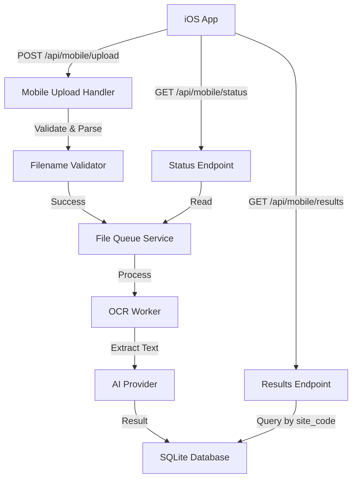

# Design Document

## Overview

This feature enables the Historic Graves iOS Survey App to asynchronously upload monument photos to the TextHarvester web service for OCR processing. The architecture decouples the mobile upload process from the heavy lifting of OCR, using a queue-based approach on the server and a robust retry mechanism on the client.

Key design decisions:
- **No Client Auth**: To lower barriers for community groups, the API is open but rate-limited (implicit via processing speed).
- **Site Code from Filename**: Metadata is embedded in filenames (`site_code-number.jpg`) to avoid complex multipart parsing logic.
- **Shared Processing Queue**: Mobile uploads join the same processing queue as web uploads, ensuring consistent resource usage.

## Architecture

### High-Level Architecture



### Component Architecture

1. **Mobile Upload Handler**: Express route handler for accepting files, validating filenames, and enqueuing them.
2. **Filename Validator**: Utility to parse `site_code-number.jpg` and validate format.
3. **Upload Service (iOS)**: Client-side service managing the upload queue, sequential processing, and retry logic.
4. **Upload Store (iOS)**: Zustand store managing UI state for uploads.

## Components and Interfaces

### User Interface Design

#### iOS App UI

The upload interface will be integrated into the existing `Export` tab.

**1. Upload Control Panel**
- **"Upload to Server" Button**: Primary action. Disabled if no photos or no network.
- **Progress Ring**: Visual indicator of overall batch progress (e.g., "15/40").
- **Status Label**: Text showing current action ("Uploading cork-0001...", "Waiting for network...").

**2. Upload List View**
A scrollable list showing the status of each photo in the survey:
- **Row Layout**: Thumbnail | Filename | Status Icon
- **Status States**:
  - ⚪️ Pending (Gray circle)
  - 🔵 Uploading (Blue spinner)
  - ✅ Complete (Green check)
  - ⚠️ Failed (Red alert + Retry button)
  - 🟠 Retrying (Orange spinner)

**3. Error Handling UI**
- **Retry All Button**: Appears if multiple failures occur.
- **Network Toast**: "Connection lost. Pausing uploads..." (auto-dismiss).

#### Web App UI

**1. Results Page Updates**
- **Source Badge**: Add a badge/icon to result rows indicating source (`Mobile` vs `Web`).
- **Site Code Filter**: Dropdown to filter results by specific site codes.

### Core Interfaces

```typescript
// Shared Types

interface MobileUploadResponse {
  queued: boolean;
  queueId: string;
  filename: string;
  siteCode: string;
  message: string;
}

interface ProcessingStatus {
  filename: string;
  status: 'queued' | 'processing' | 'complete' | 'failed';
  error?: string;
}

// iOS Client Types

interface UploadItem {
  uri: string;
  filename: string;
  siteCode: string;
  status: 'pending' | 'uploading' | 'complete' | 'failed' | 'retrying';
  progress: number;
  retryCount: number;
  error?: string;
}
```

### Component 1: Mobile Upload Handler (Server)

Responsible for handling file uploads from the mobile app, validating them, and adding them to the processing queue.

**Test Specifications:**

*Happy Path Tests:*
- Test case: Valid file with correct `site_code-number.jpg` format is accepted (200 OK)
- Test case: File is successfully added to `IngestService` with correct metadata
- Test case: Response includes correct `queueId` and `siteCode`

*Unhappy Path Tests:*
- Test case: Invalid filename format returns 400 Bad Request
- Test case: Non-image file type returns 400 Bad Request
- Test case: File size exceeding limit returns 413 Payload Too Large
- Test case: Queue service failure returns 503 Service Unavailable

### Component 2: Filename Validator (Server)

Parses and validates filenames to extract site codes.

**Test Specifications:**

*Happy Path Tests:*
- Test case: "cork-0001.jpg" -> valid, site_code="cork"
- Test case: "kilm-1234.jpeg" -> valid, site_code="kilm"
- Test case: "test-0001.JPG" -> valid, site_code="test" (case insensitive ext)

*Unhappy Path Tests:*
- Test case: "image.jpg" -> invalid, missing parts
- Test case: "cork0001.jpg" -> invalid, missing separator
- Test case: "site-code-001.jpg" -> invalid, too many dashed parts (strict mode)
- Test case: Empty string or null input -> throws error

### Component 3: Upload Service (iOS)

Manages the upload queue, sequential processing, and retry logic.

**Test Specifications:**

*Happy Path Tests:*
- Test case: Successfully uploads a single file
- Test case: Successfully uploads multiple files sequentially
- Test case: Updates progress callback during upload

*Unhappy Path Tests:*
- Test case: Retries 3 times on 500 server error
- Test case: Does NOT retry on 400 client error
- Test case: Handles network timeout gracefully
- Test case: Resumes queue after paused/interrupted state

## Data Models

### Database Schema Update

We need to modify the `memorials` table to allow efficient filtering by site code.

```sql
-- Migration: 00X_add_site_code_to_memorials.sql
ALTER TABLE memorials ADD COLUMN site_code TEXT;
CREATE INDEX idx_memorials_site_code ON memorials(site_code);
```

### API Response Models

**POST /api/mobile/upload**
```json
{
  "status": "queued",
  "queueId": "12345",
  "filename": "cork-0001.jpg",
  "siteCode": "cork"
}
```

**GET /api/mobile/status/:siteCode**
```json
{
  "siteCode": "cork",
  "total": 50,
  "processed": 20,
  "queued": 30,
  "items": [
    { "filename": "cork-0001.jpg", "status": "complete" },
    { "filename": "cork-0002.jpg", "status": "processing" }
  ]
}
```

## Error Handling

### Error Classification

1. **Validation Error (400)**: Invalid filename, file type, or malformed request. No retry.
2. **Payload Error (413)**: File too large. No retry.
3. **Server Error (500/503)**: Database locked, queue full, or crash. **Retry eligible**.
4. **Network Error**: Timeout or unreachable. **Retry eligible**.

### Error Handling Strategy

**Client-Side (iOS):**
- **Exponential Backoff**: On retry-eligible errors, wait `2^retryCount` seconds (1s, 2s, 4s).
- **Max Retries**: Cap at 3 attempts.
- **Fail Fast**: Client errors (4xx) fail immediately to prevent wasted bandwidth.

**Server-Side:**
- **Graceful Rejection**: If queue is full or disk is full, return distinct error codes.
- **Logging**: Log all failed upload attempts with source IP and filename for debugging.

## Testing Strategy

### Unit Testing

**Server:**
- `mobileUploadHandler.test.js`: Mock `multer` and `IngestService`. Test valid/invalid uploads.
- `filenameValidator.test.js`: Pure function tests for regex logic.

**iOS:**
- `uploadService.test.ts`: Mock `fetch`. Test retry loop and backoff timing.
- `uploadStore.test.ts`: Test state transitions (pending -> uploading -> complete).

### Integration Testing

- **Upload Flow**: Upload file -> Check it appears in Queue -> Check it appears in DB.
- **Status Flow**: Upload files -> Poll status endpoint -> Verify counts match.

### Compatibility Testing

- **Backward Compatibility**: Mobile uploads must play nicely with existing web uploads. The `source_type` field distinguishes them but they share the same processing pipeline.
