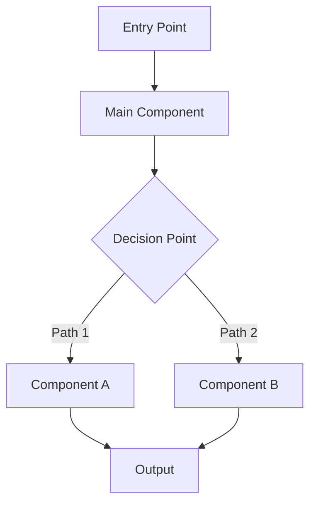

# Design Document

## Overview

[Provide a high-level overview of the solution architecture. Explain the design approach, key architectural decisions, and how the system will work at a conceptual level. Include information about how this integrates with existing systems and maintains backward compatibility if applicable.]

[Describe the design philosophy and any important trade-offs or constraints that influenced the architecture.]

## Architecture

### High-Level Architecture

[Include a Mermaid diagram showing the major components and their interactions. Use graph TB (top-bottom) or LR (left-right) format.]



### Component Architecture

[Describe the major components of the system and their responsibilities. Explain how components interact and communicate.]

1. **Component Name**: Description of responsibility and role
2. **Component Name**: Description of responsibility and role
3. **Component Name**: Description of responsibility and role
4. **Component Name**: Description of responsibility and role

## Components and Interfaces

### Core Interfaces

[Define the key TypeScript interfaces, types, and data structures used throughout the system.]

```typescript
interface MainInterface {
  property1: string;
  property2: number;
  property3: ComplexType;
}

interface ComplexType {
  field1: string;
  field2: boolean;
  field3?: OptionalType;
}

interface ConfigInterface {
  setting1: number;
  setting2: string;
  setting3: string[];
}
```

### Component 1: [Component Name]

[Describe this component in detail, including its purpose, key methods, and behavior.]

**Key Responsibilities:**
- Responsibility 1
- Responsibility 2
- Responsibility 3

**Test Specifications:**

*Happy Path Tests:*
- Test case: Expected behavior for valid primary inputs
- Test case: Expected behavior for typical use scenarios
- Test case: Successful integration with other components

*Unhappy Path Tests:*
- Test case: Invalid input handling (null, undefined, wrong type)
- Test case: Empty or malformed data handling
- Test case: Boundary conditions (min/max values, empty arrays, etc.)
- Test case: Error conditions and exception handling
- Test case: Dependency failures (external service down, network errors)
- Test case: Race conditions or timing issues (if applicable)

**Implementation Details:**
- Detail about how it works
- Detail about configuration or settings
- Detail about edge cases or special behavior

**Example Usage:**
```typescript
// Example code showing how to use this component
```

### Component 2: [Component Name]

[Describe this component in detail, including its purpose, key methods, and behavior.]

**Key Responsibilities:**
- Responsibility 1
- Responsibility 2
- Responsibility 3

**Test Specifications:**

*Happy Path Tests:*
- Test case: Expected behavior for valid primary inputs
- Test case: Expected behavior for typical use scenarios
- Test case: Successful integration with other components

*Unhappy Path Tests:*
- Test case: Invalid input handling (null, undefined, wrong type)
- Test case: Empty or malformed data handling
- Test case: Boundary conditions (min/max values, empty arrays, etc.)
- Test case: Error conditions and exception handling
- Test case: Dependency failures (external service down, network errors)
- Test case: Race conditions or timing issues (if applicable)

**Implementation Details:**
- Detail about how it works
- Detail about configuration or settings
- Detail about edge cases or special behavior

### Component 3: [Component Name]

[Describe this component in detail, including its purpose, key methods, and behavior.]

**Key Responsibilities:**
- Responsibility 1
- Responsibility 2
- Responsibility 3

**Test Specifications:**

*Happy Path Tests:*
- Test case: Expected behavior for valid primary inputs
- Test case: Expected behavior for typical use scenarios
- Test case: Successful integration with other components

*Unhappy Path Tests:*
- Test case: Invalid input handling (null, undefined, wrong type)
- Test case: Empty or malformed data handling
- Test case: Boundary conditions (min/max values, empty arrays, etc.)
- Test case: Error conditions and exception handling
- Test case: Dependency failures (external service down, network errors)
- Test case: Race conditions or timing issues (if applicable)

**Implementation Details:**
- Detail about how it works
- Detail about configuration or settings
- Detail about edge cases or special behavior

## Data Models

### Data Model 1

[Define data structures that will be stored, passed between components, or persisted.]

```typescript
interface DataModel1 {
  id: string;
  timestamp: Date;
  data: ComplexData;
  metadata?: Record<string, unknown>;
}
```

### Data Model 2

```typescript
interface DataModel2 {
  field1: string;
  field2: number;
  nestedData: {
    subfield1: string;
    subfield2: boolean;
  };
}
```

### Configuration Schema

[Define the configuration structure for the system, including environment variables and settings.]

```typescript
interface SystemConfig {
  // Core configuration
  setting1: string;
  setting2: number[];
  
  // Feature-specific configuration
  featureConfig: {
    option1: boolean;
    option2: string;
  };
  
  // Resource limits and optimization
  maxConcurrent: number;
  timeoutMs: number;
  retryAttempts: number;
}
```

## Error Handling

### Error Classification

[Define the types of errors the system will handle and how they're categorized.]

1. **Error Type 1**: Description of when it occurs and what it means
2. **Error Type 2**: Description of when it occurs and what it means
3. **Error Type 3**: Description of when it occurs and what it means
4. **Error Type 4**: Description of when it occurs and what it means
5. **Error Type 5**: Description of when it occurs and what it means

### Error Handling Strategy

[Describe how the system will handle errors, including retry logic, fallback mechanisms, and recovery strategies.]

```typescript
class ErrorHandler {
  async handleError(error: Error, context: ErrorContext): Promise<Result> {
    // Error handling logic
    // Retry mechanisms
    // Fallback strategies
  }
}
```

### Error Recovery

[Describe recovery mechanisms and graceful degradation strategies.]

- **Strategy 1**: How the system recovers from specific failure scenarios
- **Strategy 2**: Fallback behavior when primary methods fail
- **Strategy 3**: Circuit breaker or similar patterns to prevent cascading failures
- **Strategy 4**: Monitoring and alerting for operational awareness

## Testing Strategy

### Unit Testing

[Describe what will be unit tested and the approach.]

**Component 1 Tests:**
- Test case category 1
- Test case category 2
- Test case category 3

**Component 2 Tests:**
- Test case category 1
- Test case category 2
- Test case category 3

**Integration Tests:**
- End-to-end workflow tests
- Component interaction tests
- Error handling across components
- Configuration and setup tests

### Performance Testing

[Describe performance testing approach if relevant.]

**Load Testing:**
- Concurrent operation handling
- Resource usage under load
- Response time degradation
- Throughput metrics

**Stress Testing:**
- Maximum capacity testing
- Resource exhaustion scenarios
- Recovery from overload
- Memory leak detection

### Compatibility Testing

[Describe compatibility testing for backward compatibility, integration with other systems, etc.]

**Backward Compatibility:**
- Existing API contract validation
- Data structure compatibility
- Error handling consistency
- Performance regression testing

**Integration Compatibility:**
- External system integrations
- API version compatibility
- Data format compatibility

### Monitoring and Observability

[Describe how the system will be monitored and debugged in production.]

**Metrics Collection:**
- Success/failure rates
- Performance metrics (latency, throughput)
- Resource utilization (CPU, memory, etc.)
- Business metrics (domain-specific)

**Logging Strategy:**
- Structured logging with correlation IDs
- Log levels and verbosity
- Debug information for troubleshooting
- Security and audit logs

**Alerting:**
- High error rates
- Performance degradation
- Resource exhaustion warnings
- Business-critical failures

---

## Design Document Guidelines

### Architecture Section
- Start with a Mermaid diagram showing the overall flow
- Explain major components and their interactions
- Describe the design philosophy and key decisions
- Include both structural and behavioral views

### Components and Interfaces
- Define clear TypeScript interfaces for all major data structures
- Describe each component's responsibilities and behavior
- **Include test specifications for each component** with both happy and unhappy paths
- Explain how components communicate and depend on each other
- Include code examples where helpful
- Define test data structures and mock interfaces alongside production interfaces
- For each component, specify test cases for:
  - **Happy path**: Valid inputs, successful operations, expected outputs
  - **Unhappy path**: Invalid inputs, errors, edge cases, failure scenarios

### Data Models
- Define all data structures that cross component boundaries
- Include persistence schemas if data is stored
- Document configuration structures and environment variables
- Consider versioning and evolution of data models

### Error Handling
- Classify error types systematically
- Describe retry and recovery strategies
- Explain graceful degradation approaches
- Include circuit breaker or similar resilience patterns

### Testing Strategy
- **Follow Test-Driven Development**: Tests should be written before implementation
- **Test BOTH happy and unhappy paths for every component**
- Cover unit, integration, performance, and compatibility testing
- Define specific test cases for each component in the design phase
- Include monitoring and observability plans
- Describe both testing during development and production monitoring
- **Unhappy path coverage must include:**
  - Invalid inputs and data validation failures
  - Null/undefined handling
  - Boundary conditions (empty arrays, max values, etc.)
  - External dependency failures
  - Timeout and resource exhaustion scenarios
  - Concurrent access and race conditions
  - Network failures and retries
- Specify test data structures, mocks, and fixtures needed for both paths

