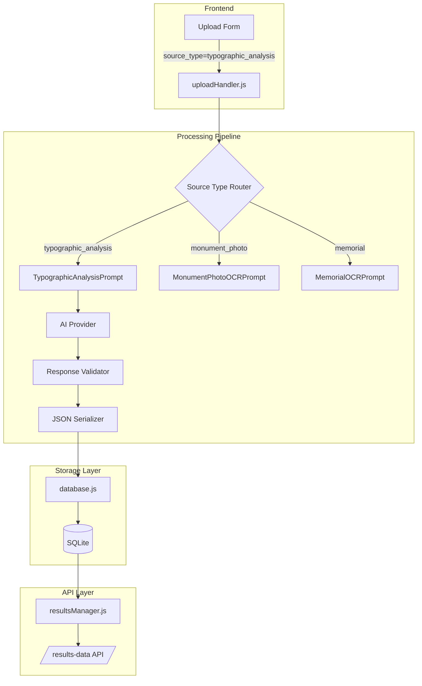

# Typographic Analysis Feature — Design Document

## Overview

This document describes the architecture and component design for the Typographic Analysis feature. The feature adds a new source type to TextHarvester that produces comprehensive transcriptions with rich typography, iconography, and stone condition analysis.

**Design Philosophy:**
- **Extend, don't modify**: Add new components alongside existing ones rather than modifying core behavior
- **Schema validation first**: Define strict TypeScript-like interfaces that the AI response must match
- **JSON-blob storage**: Store complex nested analysis data as serialized JSON in TEXT columns for queryability
- **Provider agnostic**: Design the prompt template to work with OpenAI and Anthropic (Gemini support deferred)

**Key Trade-offs:**
- Using JSON blobs instead of normalized tables for iconography data (simpler schema, harder to query individual motifs)
- Storing `transcription_raw` separately from `inscription` (duplication but clearer semantics)
- Accepting some AI judgment calls (e.g., style period) rather than strict validation (flexibility vs. precision)

---

## Architecture

### High-Level Architecture



### Component Architecture

1. **TypographicAnalysisPrompt**: New prompt template implementing the client's V2.3 approach with rich output schema
2. **TypographicAnalysisValidator**: Validates AI response against the expected schema, normalizes notation
3. **Database Migration**: Adds new columns to `memorials` table for analysis data
4. **Storage Layer Updates**: Serializes/deserializes JSON blobs for complex fields
5. **Results Manager Updates**: Includes new fields in API responses

---

## Components and Interfaces

### Core Interfaces

```typescript
/**
 * Complete output schema for Typographic Analysis
 * Extends the base memorial fields with rich analysis sections
 */
interface TypographicAnalysisResult {
  // Core identification (existing fields)
  memorial_number: number | null;
  first_name: string | null;
  last_name: string | null;
  year_of_death: number | string | null;  // string for partial dates like "19--"
  inscription: string | null;              // Cleaned for search
  
  // New: Exact transcription preserving original layout
  transcription_raw: string;               // Line-for-line with | separators
  
  // New: Analysis sections
  stone_condition: string | null;
  typography_analysis: TypographyAnalysis | null;
  iconography: Iconography | null;
  structural_observations: string | null;
}

interface TypographyAnalysis {
  serif_style?: string;           // e.g., "Roman serif with decorative terminals"
  italic_usage?: boolean;
  long_s_present?: boolean;       // ſ character
  thorn_present?: boolean;        // þ character  
  superscript_usage?: string[];   // e.g., ["th", "nd", "st"]
  case_style?: string;            // e.g., "Mixed case", "All capitals"
  letter_consistency_notes?: string;
}

interface Iconography {
  visual_motifs?: string[];       // e.g., ["Celtic cross", "IHS monogram"]
  geometric_elements?: string[];  // e.g., ["Concentric circles", "Ribbed volutes"]
  border_foliage?: string[];      // e.g., ["Cordate leaves", "Undulating vine"]
  daisy_wheels?: boolean;         // Compass-drawn hexfoils
  style_technique?: StyleTechnique;
}

interface StyleTechnique {
  period?: string;                // e.g., "Victorian Gothic Revival"
  carving_depth?: string;         // e.g., "High relief", "Incised"
  regional_style?: string;        // e.g., "Irish rural", "Scottish Borders"
}

/**
 * Database row representation (JSON serialized)
 */
interface MemorialRowExtended {
  // Existing columns
  id: number;
  memorial_number: number | null;
  first_name: string | null;
  last_name: string | null;
  year_of_death: number | null;
  inscription: string | null;
  file_name: string;
  ai_provider: string;
  model_version: string | null;
  prompt_template: string | null;
  prompt_version: string | null;
  processed_date: string;
  source_type: string | null;
  site_code: string | null;
  
  // New columns (TEXT, JSON serialized)
  transcription_raw: string | null;
  stone_condition: string | null;
  typography_analysis: string | null;   // JSON.stringify(TypographyAnalysis)
  iconography: string | null;           // JSON.stringify(Iconography)
  structural_observations: string | null;
}
```

---

### Component 1: TypographicAnalysisPrompt

New prompt template class extending `BasePrompt` that implements the client's V2.3 approach.

**Key Responsibilities:**
- Generate system and user prompts for OpenAI and Anthropic providers
- Validate AI responses against the `TypographicAnalysisResult` schema
- Normalize line separators (`\n` → `|`) and notation (`[?]` → `-`)
- Convert validated data for database storage

**Test Specifications:**

*Happy Path Tests:*
- `getProviderPrompt('openai')` returns object with `systemPrompt` and `userPrompt` containing typography/iconography instructions
- `getProviderPrompt('anthropic')` returns properly formatted prompts for Claude
- `validateAndConvert()` with valid complete response returns all fields populated correctly
- `validateAndConvert()` with partial iconography (some fields null) returns valid object with nulls preserved
- Historical characters (ſ, þ) in `transcription_raw` are preserved unchanged

*Unhappy Path Tests:*
- `getProviderPrompt('unsupported_provider')` throws error listing supported providers
- `validateAndConvert(null)` throws `ProcessingError` with type `validation_error`
- `validateAndConvert({})` throws `ProcessingError` with type `empty_monument`
- `validateAndConvert()` with missing required `transcription_raw` throws validation error
- `validateAndConvert()` with `[?]` notation in transcription throws error requesting correct notation
- `validateAndConvert()` with `\n` in transcription normalizes to `|` (recovery, not error)
- `validateAndConvert()` with malformed `iconography` (wrong types) throws specific field error

**Implementation Details:**
- Extends `BasePrompt` from `src/utils/prompts/BasePrompt.js`
- Prompt text emphasizes: line-for-line fidelity, dash notation, botanical terms, mechanical descriptions
- Provider-specific formatting in `getProviderPrompt()` method
- Validation uses defensive parsing with detailed error messages

**Example Usage:**
```javascript
const TypographicAnalysisPrompt = require('./TypographicAnalysisPrompt');
const prompt = new TypographicAnalysisPrompt();

const { systemPrompt, userPrompt } = prompt.getProviderPrompt('openai');
// Send to AI provider...

const validated = prompt.validateAndConvert(aiResponse);
// validated.transcription_raw, validated.iconography, etc.
```

---

### Component 2: Database Migration Script

Migration script to add new columns to the `memorials` table.

**Key Responsibilities:**
- Add `transcription_raw`, `stone_condition`, `typography_analysis`, `iconography`, `structural_observations` columns
- Ensure idempotent execution (safe to run multiple times)
- Maintain backward compatibility with existing data

**Test Specifications:**

*Happy Path Tests:*
- Running migration on fresh database adds all 5 new columns
- Running migration on database with existing data preserves all existing records
- New columns default to `NULL` for existing records
- Column types are `TEXT` for all new fields

*Unhappy Path Tests:*
- Running migration twice does not error (idempotent)
- Running migration on read-only database throws appropriate error
- Interrupted migration leaves database in consistent state (SQLite transaction)
- Migration on database missing `memorials` table throws clear error

**Implementation Details:**
- Location: `scripts/migrate-add-typographic-analysis.js`
- Uses SQLite `ALTER TABLE ADD COLUMN IF NOT EXISTS` pattern
- Wraps in transaction for atomicity
- Logs progress and success/failure

---

### Component 3: Storage Layer Updates (database.js)

Updates to `storeMemorial()` function to handle new JSON fields.

**Key Responsibilities:**
- Serialize `typography_analysis` and `iconography` objects to JSON strings
- Store `transcription_raw`, `stone_condition`, `structural_observations` as-is
- Handle null values correctly (store NULL, not empty string)

**Test Specifications:**

*Happy Path Tests:*
- `storeMemorial()` with full typographic analysis data stores all fields correctly
- Retrieved record has JSON fields correctly serialized in database
- `storeMemorial()` with `typography_analysis: null` stores `NULL` in database
- Existing `storeMemorial()` calls without new fields work unchanged (backward compat)

*Unhappy Path Tests:*
- `storeMemorial()` with circular reference in iconography throws serialization error
- `storeMemorial()` with extremely large JSON (>1MB) throws size warning but succeeds
- Database constraint violations (e.g., missing file_name) throw before JSON serialization
- Concurrent stores don't corrupt JSON data (SQLite handles this)

**Implementation Details:**
- Add JSON.stringify() calls for object fields before INSERT
- Check for undefined vs null (JavaScript distinction matters)
- Add try/catch around serialization with descriptive errors

---

### Component 4: Results Manager Updates (resultsManager.js)

Updates to API endpoints to include new fields in responses.

**Key Responsibilities:**
- Deserialize JSON columns when retrieving records
- Include new fields in `/results-data` response
- Support filtering/querying by new fields (future enhancement)

**Test Specifications:**

*Happy Path Tests:*
- `/results-data` includes `transcription_raw` and analysis fields for typographic records
- JSON fields are deserialized to objects in API response (not raw strings)
- Records without typographic analysis return `null` for new fields (not missing keys)
- CSV export includes new fields as columns

*Unhappy Path Tests:*
- Corrupted JSON in database column returns `null` with logged warning (not crash)
- Missing columns in older database returns `null` for new fields (graceful degradation)
- Extremely large JSON fields don't timeout the API response
- Invalid UTF-8 in `transcription_raw` is handled (shouldn't happen, but defensive)

**Implementation Details:**
- Add JSON.parse() with try/catch for object fields
- Update `MEMORIAL_FIELDS` constant to include new columns
- Add new fields to CSV export column list

---

### Component 5: Provider Templates Registration

Register the new prompt template in the factory system.

**Key Responsibilities:**
- Add `TypographicAnalysisPrompt` to `providerTemplates.js`
- Register in `PromptFactory.js` for source type routing
- Update `fileProcessing.js` to handle new source type

**Test Specifications:**

*Happy Path Tests:*
- `getPrompt('openai', 'typographicAnalysis')` returns `TypographicAnalysisPrompt` instance
- `getPrompt('anthropic', 'typographicAnalysis')` returns `TypographicAnalysisPrompt` instance
- Source type `typographic_analysis` routes to correct prompt template

*Unhappy Path Tests:*
- `getPrompt('openai', 'unknownTemplate')` throws error with available templates listed
- `getPrompt('gemini', 'typographicAnalysis')` throws unsupported provider error
- Missing registration causes clear error in processing pipeline

---

## Data Models

### Database Schema Changes

```sql
-- New columns added to memorials table
ALTER TABLE memorials ADD COLUMN transcription_raw TEXT;
ALTER TABLE memorials ADD COLUMN stone_condition TEXT;
ALTER TABLE memorials ADD COLUMN typography_analysis TEXT;  -- JSON
ALTER TABLE memorials ADD COLUMN iconography TEXT;          -- JSON
ALTER TABLE memorials ADD COLUMN structural_observations TEXT;
```

### JSON Schema: typography_analysis

```json
{
  "$schema": "http://json-schema.org/draft-07/schema#",
  "type": "object",
  "properties": {
    "serif_style": { "type": ["string", "null"] },
    "italic_usage": { "type": ["boolean", "null"] },
    "long_s_present": { "type": ["boolean", "null"] },
    "thorn_present": { "type": ["boolean", "null"] },
    "superscript_usage": { 
      "type": ["array", "null"],
      "items": { "type": "string" }
    },
    "case_style": { "type": ["string", "null"] },
    "letter_consistency_notes": { "type": ["string", "null"] }
  },
  "additionalProperties": false
}
```

### JSON Schema: iconography

```json
{
  "$schema": "http://json-schema.org/draft-07/schema#",
  "type": "object",
  "properties": {
    "visual_motifs": {
      "type": ["array", "null"],
      "items": { "type": "string" }
    },
    "geometric_elements": {
      "type": ["array", "null"],
      "items": { "type": "string" }
    },
    "border_foliage": {
      "type": ["array", "null"],
      "items": { "type": "string" }
    },
    "daisy_wheels": { "type": ["boolean", "null"] },
    "style_technique": {
      "type": ["object", "null"],
      "properties": {
        "period": { "type": ["string", "null"] },
        "carving_depth": { "type": ["string", "null"] },
        "regional_style": { "type": ["string", "null"] }
      },
      "additionalProperties": false
    }
  },
  "additionalProperties": false
}
```

---

## Error Handling

### Error Classification

1. **ValidationError**: AI response doesn't match expected schema (malformed JSON, wrong types, missing required fields)
2. **EmptyMonumentError**: No readable text or carvings detected on the monument
3. **NotationError**: AI used incorrect notation (`[?]` instead of `-`, `\n` instead of `|`)
4. **ProviderError**: AI provider unavailable, timeout, or rate limited
5. **StorageError**: Database write failure, serialization error, constraint violation

### Error Handling Strategy

```javascript
class TypographicAnalysisError extends ProcessingError {
  constructor(message, errorType, details = {}) {
    super(message, errorType);
    this.details = details;
  }
}

// In validateAndConvert():
try {
  // Validate response...
} catch (error) {
  if (error.type === 'notation_error') {
    // Attempt auto-correction first
    const corrected = this.normalizeNotation(rawData);
    if (corrected) {
      return this.validateAndConvert(corrected);
    }
  }
  throw new TypographicAnalysisError(
    `Validation failed: ${error.message}`,
    'validation_error',
    { field: error.field, received: error.value }
  );
}
```

### Error Recovery

- **Notation normalization**: Auto-convert `\n` → `|` and strip `[?]` markers with warning
- **Partial data acceptance**: If core fields (transcription_raw) are valid, accept record with null analysis sections
- **Logging**: All validation warnings logged for prompt refinement analysis
- **User feedback**: Clear error messages indicating what was wrong and how to fix (e.g., "AI response used [?] notation; please verify the transcription")

---

## Testing Strategy

### Unit Testing

**TypographicAnalysisPrompt Tests:**
- Prompt generation for each provider
- Response validation (valid, invalid, edge cases)
- Notation normalization logic
- Historical character preservation

**Database Migration Tests:**
- Column addition
- Idempotency
- Data preservation

**Storage Layer Tests:**
- JSON serialization/deserialization
- Null handling
- Backward compatibility

### Integration Tests

**End-to-End Workflow:**
- Upload image with `source_type=typographic_analysis`
- Process through AI provider (mocked)
- Validate and store result
- Retrieve via API and verify all fields

**Backward Compatibility:**
- Verify existing source types still work
- Verify old records still retrievable
- Verify migrations don't break existing data

### Test Fixtures

```javascript
// Valid complete response
const validCompleteResponse = {
  memorial_number: null,
  first_name: "JOHN",
  last_name: "SMITH",
  year_of_death: 1857,
  inscription: "IN LOVING MEMORY OF JOHN SMITH",
  transcription_raw: "IN LOVING MEMORY|OF|JOHN SMITH|WHO DEPARTED THIS LIFE|APRIL 10TH 1857|AGED 72 YEARS|R.I.P.",
  stone_condition: "Limestone, moderate weathering, moss on lower portion",
  typography_analysis: {
    serif_style: "Roman serif with bracketed terminals",
    italic_usage: false,
    long_s_present: false,
    thorn_present: false,
    superscript_usage: ["TH"],
    case_style: "All capitals",
    letter_consistency_notes: null
  },
  iconography: {
    visual_motifs: ["Celtic cross", "IHS monogram"],
    geometric_elements: ["Concentric circles at cross center"],
    border_foliage: ["Cordate leaves", "Undulating vine border"],
    daisy_wheels: false,
    style_technique: {
      period: "Victorian Gothic Revival",
      carving_depth: "High relief",
      regional_style: "Irish rural"
    }
  },
  structural_observations: "7 rows, centered alignment, decreasing font size toward bottom"
};

// Valid minimal response (no decorative elements)
const validMinimalResponse = {
  memorial_number: null,
  first_name: "MARY",
  last_name: "DOE",
  year_of_death: "19--",
  inscription: "MARY DOE",
  transcription_raw: "MARY DOE|19-- - 19--|REST IN PEACE",
  stone_condition: "Granite, severe erosion",
  typography_analysis: null,
  iconography: null,
  structural_observations: "3 rows, left-aligned"
};

// Invalid: wrong notation
const invalidNotationResponse = {
  transcription_raw: "JOHN [?] SMITH|DIED [ILLEGIBLE]",
  // ... other fields
};

// Invalid: missing required field
const invalidMissingTranscription = {
  memorial_number: null,
  first_name: "JOHN",
  // transcription_raw missing!
};
```

---

## Monitoring and Observability

### Logging Strategy

- **INFO**: Successful processing with source_type, provider, record ID
- **WARN**: Notation corrections applied, quality warnings (interpretive labels used)
- **ERROR**: Validation failures, storage errors, provider errors

### Metrics (Future Enhancement)

- Processing time by source_type
- Validation failure rate
- Notation correction frequency (indicates prompt quality)
- Iconography field population rate (are monuments actually decorated?)

---
